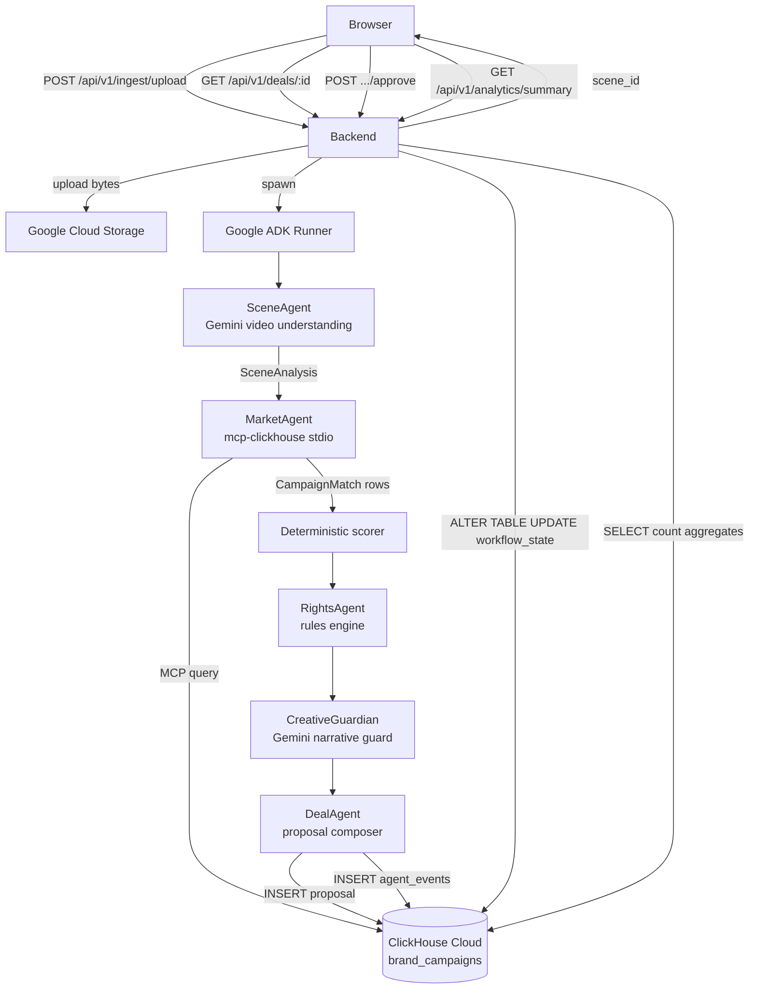

# CineYield

**Agentic product-placement operating system for entertainment.**

CineYield analyses every scene in a show for commercial opportunity, runs an AI orchestration pipeline (Google ADK + Gemini) to match brands, check rights, guard creative integrity, and close a deal — all within seconds of a video upload.

---

## What is CineYield?

CineYield is an automated content-monetisation layer for streaming libraries. A producer uploads a video clip; CineYield's multi-agent pipeline returns a ranked brand deal, ready to approve. The approved placement and its analytics are persisted in real time to ClickHouse Cloud.

**This is not a mockup.** Every integration below is live against real cloud services.

---

## What is real vs. demo

| Component | Status |
|-----------|--------|
| Gemini video understanding (Vertex AI) | **Real** — live API call per upload |
| Google ADK `LlmAgent` orchestration | **Real** — `adk_used: true` in every job response |
| Google Cloud Storage (video upload) | **Real** — `cineyield-videos-dev` bucket |
| ClickHouse Cloud (scenes, campaigns, proposals, analytics) | **Real** — 27 brand campaigns, persistent state |
| official `mcp-clickhouse` stdio transport | **Real** — subprocess spawned per pipeline run; ~1–4 s per query (spawn + round-trip to ClickHouse Cloud) |
| Deterministic campaign scoring | **Real** — Python rules engine, no LLM hallucination in ranking |
| Rights Agent, Creative Guardian | **Real** — rules + Gemini narrative guard |
| Deal proposal + approval persistence | **Real** — `workflow_state` column in ClickHouse |
| Scene library content | **Demo fiction** — shows and characters are fictional |
| HORIZONS episode footage | **Deferred** — engineering test MP4 used for judging |
| Market revenue figures | **Illustrative** — not audited financial data |

---

## Partner tracks

- **ClickHouse** — `mcp-clickhouse` (official stdio MCP server) queries `cineyield.brand_campaigns` live on every pipeline run. Per-agent latency is recorded to `cineyield.agent_events`. Analytics at `/api/v1/analytics/summary` read from ClickHouse directly.
- **Google ADK** — `LlmAgent` + `Runner(auto_create_session=True)` orchestrates five agents end-to-end. `adk_used: true` and `pipeline_version: adk_llmagent_v1` are present in every job result.

---

## Architecture



---

## Stack

| Layer | Technology |
|-------|------------|
| Frontend | Next.js 15 (App Router), React 19, Tailwind 4 |
| Backend | FastAPI (Python 3.12), Google ADK 2.7.1 |
| AI | Gemini 2.5 Flash via Vertex AI (ADC, no API key) |
| Storage | Google Cloud Storage |
| Database | ClickHouse Cloud (SharedMergeTree) |
| MCP | official `mcp-clickhouse` (stdio transport) |
| Deployment | Google Cloud Run (fully serverless) |

---

## Local quickstart

### Prerequisites

- Python 3.12+, Node 20+
- `gcloud` CLI authenticated: `gcloud auth application-default login`
- A ClickHouse Cloud cluster with the CineYield schema applied (`infra/clickhouse/`)
- Google Cloud project with Vertex AI enabled

### Backend

```bash
cd apps/agent-api
python -m venv .venv && source .venv/bin/activate
pip install -r requirements.txt
cp .env.example .env
# Fill in: GOOGLE_CLOUD_PROJECT, GCS_BUCKET_NAME, CLICKHOUSE_HOST, CLICKHOUSE_PASSWORD
make dev
# → http://localhost:8000
```

### Frontend

```bash
cd apps/web
npm install
# Create apps/web/.env.local with: NEXT_PUBLIC_API_URL=http://localhost:8000
npm run dev
# → http://localhost:3000
```

### ClickHouse schema

```bash
# Apply schema and seed data (requires CLICKHOUSE_* env vars)
cd infra/clickhouse
# Run 00_init_schema.sql → 01_seed.sql via ClickHouse client or Cloud console
```

---

## Test commands

### Backend

```bash
cd apps/agent-api
source .venv/bin/activate
pytest tests/ -v                   # 174/174 tests
ruff check cineyield/              # lint
mypy cineyield/                    # typecheck
```

### Frontend

```bash
cd apps/web
npm run lint          # ESLint
npm run typecheck     # tsc --noEmit
npm run build         # production build
```

### Playwright E2E (requires both servers running)

```bash
cd apps/web
npx playwright test --reporter=list
# 8/8 tests pass
```

### CI

`.github/workflows/ci.yml` runs on every push/PR to `main`: backend `ruff` + `mypy` + `pytest -m "not integration and not contest"`, and frontend `typecheck` + `lint` + `build`. It needs no cloud credentials and none are configured for it — it cannot and does not check ClickHouse, Gemini, or mcp-clickhouse. That's what the contest gate below is for.

---

## Public deployment

Deployed on Google Cloud Run:

| Service | URL |
|---------|-----|
| Frontend | https://cineyield-web-pg7lg7ldma-uc.a.run.app |
| Backend | https://cineyield-api-pg7lg7ldma-uc.a.run.app |
| API docs | https://cineyield-api-pg7lg7ldma-uc.a.run.app/docs |

### Deploy

```bash
# 1. Authenticate gcloud CLI (one-time, interactive — must be done by the account owner)
gcloud auth login

# 2. Run the automated deployment script
bash scripts/deploy.sh
```

The script enables required APIs, creates a least-privilege service account, stores the ClickHouse password in Secret Manager, deploys the backend and frontend to Cloud Run, and updates CORS automatically.

---

## Contest mode

Set `CINEYIELD_MODE=contest` to require all integrations. In contest mode:

- Gemini must respond (no fixture fallback)
- ClickHouse must be reachable (no local JSON)
- mcp-clickhouse must be callable (hard fail if binary missing)
- Any pipeline failure surfaces as an HTTP 503 rather than a degraded response

The production Cloud Run **backend** always runs with `CINEYIELD_MODE=contest` — integration failures surface as errors, never a fixture fallback. The **frontend** does not run in contest mode: it degrades gracefully, falling back to fixture data if the backend is unreachable, and now shows an on-screen notice whenever it does so, so a fallback is never mistaken for live output.

### Contest gate

CI (above) can't verify ClickHouse, Gemini, or mcp-clickhouse — it has no credentials. This is the one command that does, against a running backend, local or deployed:

```bash
bash scripts/smoke-contest.sh                          # http://localhost:8000
bash scripts/smoke-contest.sh http://localhost:8014     # local, custom port
bash scripts/smoke-contest.sh https://cineyield-api-xxx.run.app   # deployed
```

It fails non-zero, with a specific reason, unless: Gemini/ClickHouse/GCS are configured, ClickHouse is reachable, **mcp-clickhouse is reachable through the app's own integration** (`GET /api/v1/opportunities/{id}/matches`, never a direct query), Gemini actually answers (`POST .../propose`'s Gemini narrative call), the canonical demo asset/scene/opportunity exist, and a real agent run persists a new `cineyield.agent_events` row. The credentialed non-HTTP equivalents (`make mcp-health`, `make test-contest`, `make clickhouse-verify` in `apps/agent-api/`) check the same integrations directly against `.env` rather than over HTTP.

---

## Demo reset

```bash
# Local
bash scripts/demo-reset.sh

# Production
bash scripts/demo-reset.sh https://cineyield-api-xxxx-uc.a.run.app
```

Deletes proposals and revenue events for the canonical demo opportunity only. Does not affect brand campaigns, scenes, or agent event history.

---

## Endpoints

```
GET  /health                               liveness
GET  /ready                                readiness (checks gemini/gcs/clickhouse)
GET  /docs                                 OpenAPI (Swagger UI)

GET  /api/v1/content                       scene library
GET  /api/v1/scenes/{id}                   scene detail
GET  /api/v1/scenes/{id}/opportunities     placement opportunities
GET  /api/v1/opportunities/{id}/matches    ranked brand campaigns
POST /api/v1/ingest/upload                 upload video → full ADK pipeline
GET  /api/v1/ingest/status/{job_id}        poll pipeline job
POST /api/v1/opportunities/{id}/propose    create proposal
GET  /api/v1/deals/{id}                    deal detail (workflow_state)
POST /api/v1/deals/{id}/approve            approve or reject
GET  /api/v1/pipeline/status               component readiness
GET  /api/v1/analytics/summary             approved deals + revenue (ClickHouse)
GET  /api/v1/agents/events                 agent execution trace (ClickHouse)
POST /api/v1/demo/reset                    demo state reset
```
